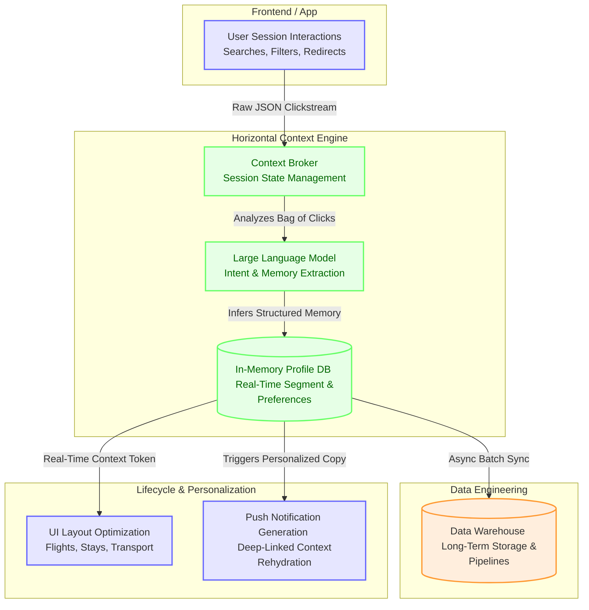

# Horizontal Context Engine (User Memory)

This project explores a **Horizontal Context Engine (HCE)** prototype designed for multi-vertical platforms (e.g., Flights, Stays, Transport). The architecture demonstrates how unstructured clickstream data can be analyzed by a Large Language Model (LLM) to extract user intent in real-time, allowing context to persist seamlessly across isolated product verticals.

## Architecture: The AI-Native Memory Layer

The system captures raw interaction logs, infers long-term user preferences (personas, baggage tolerance, trip vibe), and leverages that memory to personalize UI layouts and generate real-time Lifecycle Communications (e.g., highly targeted push notifications).



### Core Architecture Components Explained

*   **User Session Interactions:** Captures the raw "bag of clicks" generated by a user. Instead of relying on linear funnel tracking, it processes unstructured browsing behavior (e.g., opening multiple tabs simultaneously for comparison shopping).
*   **Context Broker:** The central orchestration layer. It intercepts real-time clickstream events, manages the user's active session state, and determines when to trigger LLM intent extraction.
*   **LLM Intent & Memory Extraction:** The reasoning engine. It ingests the raw JSON clickstream and infers structured, contextual memory (e.g., identifying a user as a "Solo Backpacker" based on their search parameters). 
*   **In-Memory Profile DB:** A low-latency access layer (simulating Redis) that holds the active structured user profile for real-time querying.
*   **Long-Term Memory Storage:** While the active session lives in memory, persistent user traits are synced asynchronously to a Data Warehouse (e.g., Databricks/BigQuery). This enables downstream data pipelines to utilize rich, LLM-inferred segments for offline analytics, cohort analysis, and long-term CRM campaigns.
*   **UI Layout Optimization & Push Generation:** The downstream consumers of the memory. *Example: A user searches for a budget, carry-on-only flight to Berlin. When they navigate to the "Stays" tab, the UI queries the Context Broker and automatically adapts the layout to highlight top-rated backpacker hostels in Berlin, rather than showing generic luxury family resorts.*

## Economics at Scale: Cost Projections

Historically, applying Large Language Models to every user session was cost-prohibitive. However, using highly optimized, lightweight LLMs makes real-time "Context Engineering" viable. 

Based on our prototype simulation:
*   **Estimated Cost per Session:** `$0.000138 USD` (Assuming ~1,500 input tokens and ~80 output tokens per extraction).
*   **100M User Scale Assumption:** Assuming a platform scaling to 100 Million Monthly Active Users (MAU), with each user triggering one memory extraction per month, the estimated API compute cost would be approximately **$13,800 per month**.

Given the massive Total Addressable Market (TAM) in travel metasearch, the compute overhead is minimal compared to the potential revenue generated by increased cross-vertical engagement.

## Proposed A/B Testing & Success Metrics

To validate this architecture in a real-world production environment, it should be deployed to a live traffic holdout (e.g., 1%). The primary goal is to determine if the ROI of real-time personalization outpaces the LLM compute costs.

**Key Metrics for A/B Testing:**
1.  **Cross-Vertical Attach Rate:** The percentage of users who successfully transition from one vertical (e.g., Flights) and engage with another (e.g., Stays).
2.  **Redirect / Booking Conversion Rate:** The lift in successful partner handoffs or direct bookings.
3.  **Session Retention:** Measuring the reduction in session abandonment when users switch contexts.
4.  **Cost per Acquisition (CPA) Impact:** Evaluating if the increased conversion rates lower the overall marketing CPA enough to subsidize the LLM API costs.

## Core Components
- `simulation.py`: The event orchestrator driving simulated user traffic and logging granular `action_details`.
- `context_broker.py`: The core Horizontal Context Engine managing state and LLM extraction routes.
- `llm_client.py`: The AI gateway handling LLM calls, implementing exponential backoffs, and tracking observability via `mlflow.trace`.

## Getting Started
To run the simulation and view the MLflow observability traces:
```bash
python simulation.py
mlflow ui --port 5001
```
