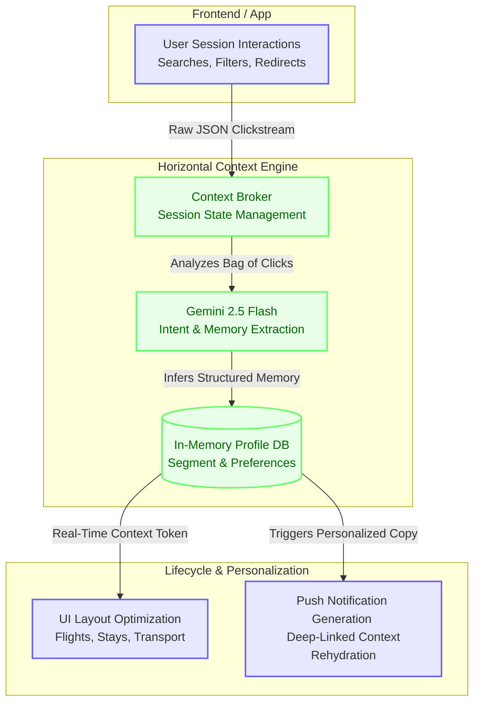

# Skyscanner: Horizontal Context Engine (User Memory)

This project simulates a **Horizontal Context Engine (HCE)** for a multi-vertical travel platform like Skyscanner. The prototype demonstrates how user intent and memory can be extracted from raw interaction logs using **Gemini 2.5 Flash** and seamlessly shared across isolated verticals (Flights, Stays, and Transport).

## Architecture: The AI-Native Memory Layer

The system captures unstructured clickstream data, infers long-term user preferences (personas, baggage tolerance, brand loyalty), and leverages that memory to personalize UI layouts and generate real-time, highly targeted Lifecycle Communications (e.g., Price Drop push notifications).



## Economics at Scale (100M MAU)

Historically, applying Large Language Models to every user session was cost-prohibitive. However, by using highly optimized models like **Gemini 2.5 Flash**, the unit economics of "Context Engineering at the edge" become viable for enterprise scale.

Based on our simulation of 30 agents over 24 steps:
*   **Total Tokens Used:** ~45,034 Input / ~2,496 Output
*   **Total Cost for 30 Users:** `$0.0041 USD`
*   **Estimated Cost per MAU:** `$0.000138 USD`

### Scaling Projection
If Skyscanner rolled this out to **100 Million Monthly Active Users (MAU)**, the estimated API compute cost to maintain this real-time memory layer would be approximately **$13,800 per month**. 

Given the simulated **+32.41% absolute conversion lift** and **+100% cross-vertical attach lift**, the ROI of real-time LLM personalization vastly outweighs the compute expenditure.

## Core Components
- `simulation.py`: The event orchestrator driving simulated user traffic and logging granular `action_details`.
- `context_broker.py`: The core Horizontal Context Engine managing state and LLM extraction routes.
- `llm_client.py`: The AI gateway handling Gemini 2.5 Flash calls, implementing exponential backoffs, and tracking observability via `mlflow.trace`.

## Getting Started
To run the simulation and view the MLflow observability traces:
```bash
python simulation.py
mlflow ui --port 5001
```
